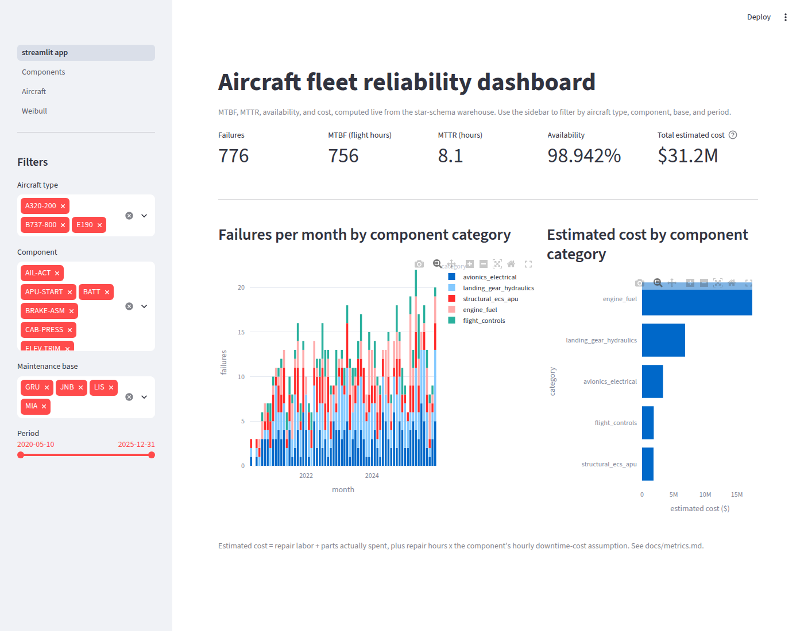
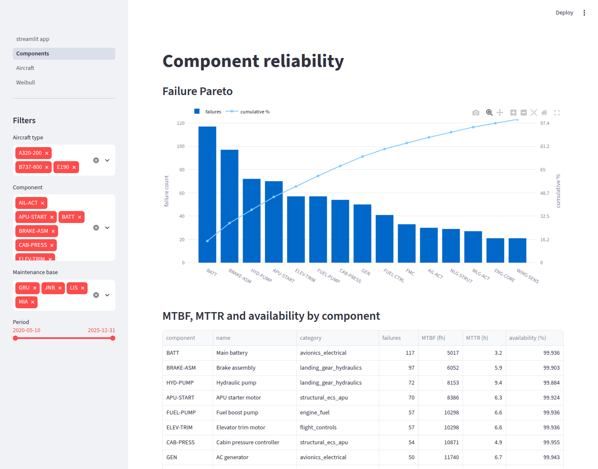
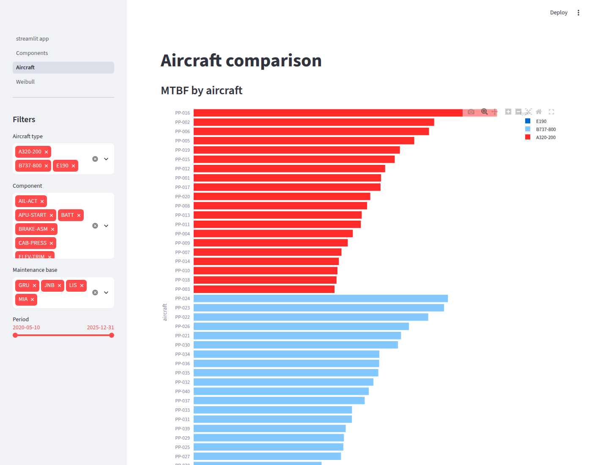
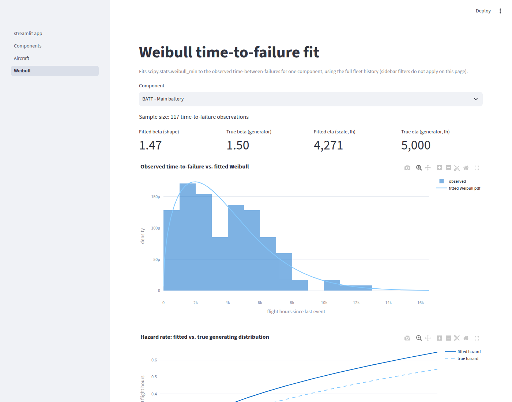

# Aircraft fleet reliability dashboard

A data engineering and visualization project simulating a reliability
monitoring system for an aircraft fleet: a Weibull-based synthetic
maintenance history, a Postgres star schema, a validated SQL metrics
layer, and an interactive Streamlit dashboard covering the classic
reliability metrics -- MTBF, MTTR, availability, failure Pareto,
Weibull hazard analysis, and estimated downtime cost.

## Architecture

```
generate.py --> CSVs --> etl.py --> staging schema --> warehouse star schema
                                                              |
                                                    sql/02_views_metrics.sql
                                                              |
                                                     Streamlit dashboard (app/)
```

- **Python + pandas + NumPy** -- synthetic data generation (Weibull
  renewal process per aircraft/component).
- **PostgreSQL** -- star-schema warehouse, one `staging` and one
  `warehouse` schema.
- **SQL** -- all reliability metrics defined as views, validated
  directly against Postgres before the dashboard ever reads them.
- **Streamlit + Plotly** -- interactive dashboard with filters by
  aircraft type, component, maintenance base, and period.
- **scipy** -- Weibull maximum-likelihood fit, shown live against the
  synthetic data's true generating parameters.

See [docs/data_model.md](docs/data_model.md) for the schema and
[docs/metrics.md](docs/metrics.md) for every metric's formula, unit,
and documented assumptions/caveats.

## Screenshots

**Overview** -- fleet KPIs, monthly failures by category, cost by category.



**Components** -- failure Pareto and the MTBF/MTTR/availability table.



**Aircraft** -- MTBF ranked by tail number, plus a per-aircraft event drill-down.



**Weibull** -- live Weibull fit on one component's time-to-failure, next to
the synthetic data's true generating parameters (β 1.47 fitted vs. 1.50 true
for the main battery, from 117 observations).



## Quickstart

```bash
python3 -m venv .venv
.venv/bin/pip install -r requirements.txt
.venv/bin/pip install -e .

docker compose up -d
cp .env.example .env   # local Postgres on port 5433

docker compose exec -T postgres psql -U fleet -d fleet_reliability < sql/01_schema.sql
docker compose exec -T postgres psql -U fleet -d fleet_reliability < sql/02_views_metrics.sql

.venv/bin/python -m fleet_reliability.generate   # writes CSVs to data/
.venv/bin/python -m fleet_reliability.etl        # loads staging -> warehouse
.venv/bin/python -m fleet_reliability.quality    # data-quality gate, exits non-zero on failure

.venv/bin/pytest                                 # 24 tests; DB tests roll back, skip if Postgres is down

.venv/bin/streamlit run app/streamlit_app.py
```

## Project layout

```
sql/01_schema.sql          star-schema DDL (staging + warehouse)
sql/02_views_metrics.sql   MTBF, MTTR, availability, Pareto, cost, Weibull input
sql/tests/*.sql            data-quality checks (each: rows returned = violations)
src/fleet_reliability/
  generate.py               Weibull-based synthetic maintenance history
  public_data.py            NTSB/ASRS-grounded failure-category weights
  etl.py                    staging -> warehouse load
  quality.py                runs sql/tests/*.sql, exits non-zero on failure
  db.py                     shared DATABASE_URL / engine
app/
  streamlit_app.py           Overview: KPIs, monthly trend, cost by category
  pages/1_Components.py      Failure Pareto + MTBF/MTTR/availability table
  pages/2_Aircraft.py        MTBF by aircraft + per-tail event drill-down
  pages/3_Weibull.py         live Weibull fit vs. the generator's true parameters
  data.py, metrics.py, filters.py, db.py
tests/
  test_generate.py          determinism, FK integrity, Weibull recovery sanity check
  test_metrics.py           known-answer test: SQL views and dashboard pandas code agree
  test_quality.py           each quality check fails on its planted bad row
  conftest.py               hand-built fixture, loaded in a transaction and rolled back
docs/images/                dashboard screenshots
docs/data_model.md          schema, grain, ERD, documented simplifications
docs/metrics.md             every metric's formula and caveats
```

## Running locally

Everything runs on your machine; there is no hosted component.

- Postgres runs in Docker (`docker-compose.yml`) and is published on host
  port **5433**, not the default 5432, so it doesn't collide with any other
  Postgres you may already run. Data persists in the `pgdata` volume.
- The ETL, the quality checks and the dashboard all read `DATABASE_URL`
  from `.env` (copied from `.env.example`).
- The dashboard is served at <http://localhost:8501> by `streamlit run`.
- To start over from an empty database, run `docker compose down -v` (this
  deletes the volume), then repeat the quickstart.
- The generated dataset is a few MB, so regenerating and reloading it
  takes seconds.

## Reliability metrics implemented

- MTBF by component and by aircraft
- MTTR
- Availability (MTBF / (MTBF + MTTR), with the flight-hours-vs-
  calendar-hours caveat documented in [docs/metrics.md](docs/metrics.md))
- Failure rate over time / Weibull hazard analysis (bathtub curve)
- Failure Pareto by component
- Estimated downtime cost by failure category

## Possible extensions

- Automatic alerts when a component's failure rate crosses a threshold.
- Airflow DAG to simulate periodic data refreshes.
- Integration with a remaining-useful-life (RUL) prediction model,
  showing predicted RUL alongside the historical metrics.
